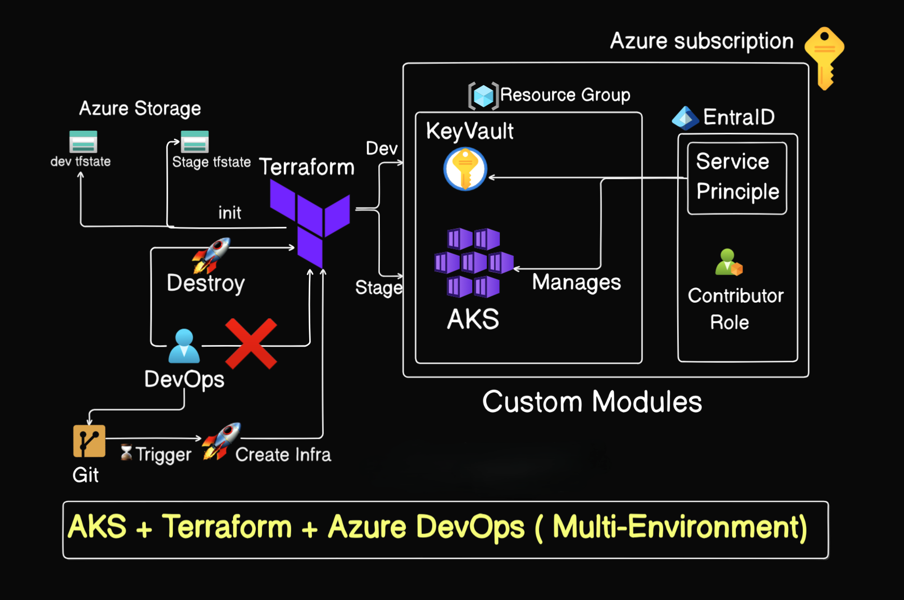
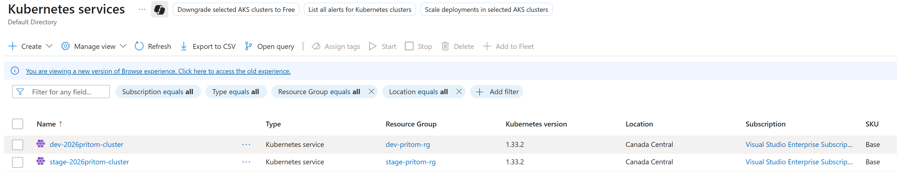
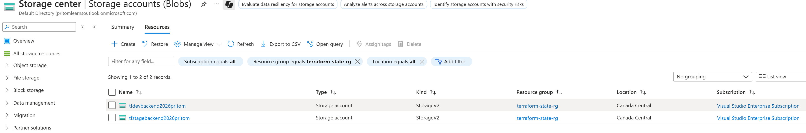
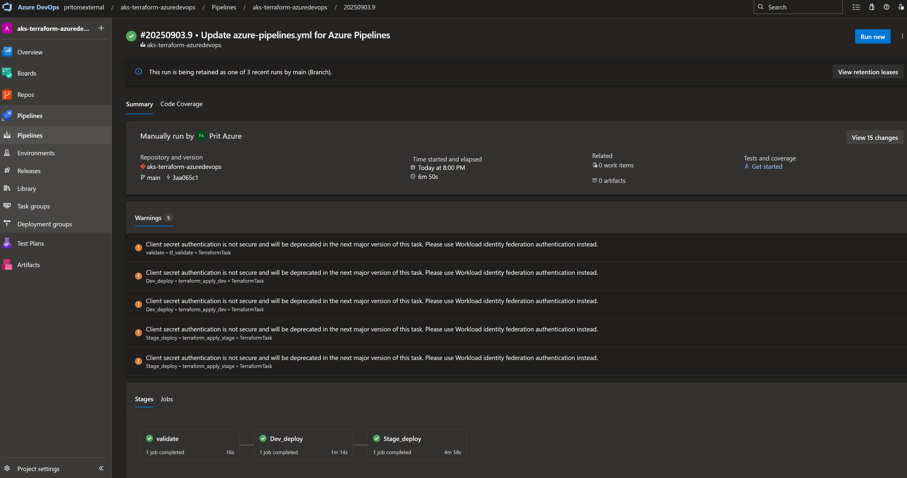

# 🧾 AKS Infrastructure Automation with Terraform & Azure DevOps Pipelines

_This project demonstrates end-to-end automation of AKS cluster deployment using Terraform integrated with Azure DevOps multi-stage pipelines. It provisions infrastructure with remote state management in Azure Storage, handles RBAC assignments, and validates deployments through CI/CD workflows. Along the way, it tackles real-world challenges like RBAC authorization errors, state backend access, and role assignment conflicts, reflecting a production-grade setup._

---

## 📌 Table of Contents
- <a href="#overview">Overview</a>
- <a href="#project-structure">Project Structure</a>
- <a href="#architecture">Architecture</a>
- <a href="#getting-started">Getting Started</a>
  - <a href="#prerequisites">Prerequisites</a>
  - <a href="#setup-instructions">Setup Instructions</a>
- <a href="#cicd-pipeline-stages">CI/CD Pipeline Stages</a>
- <a href="#screenshots--outputs">Screenshots & Outputs</a>
- <a href="#learnings--challenges">Learnings & Challenges</a>
- <a href="#author--contact">Author & Contact</a>

---

<h2><a class="anchor" id="overview"></a>Overview</h2>

This capstone automates deployment of **Azure Kubernetes Service (AKS)** using **Terraform** orchestrated by **Azure DevOps multi-stage pipelines**.  
It provisions resource groups, AKS, Key Vault and RBAC; stores state in Azure Storage; and demonstrates real-world fixes for **RBAC 403s**, **role assignment conflicts (409)**, and **backend access**.

---

<h2><a class="anchor" id="project-structure"></a>Project Structure</h2>

```
📂 aks-terraform-azuredevops/
├── 📂 .ssh/                         # (Optional) Keys used locally or by agents
├── 📂 dev/                          # Dev environment Terraform
│   ├── main.tf                      # RG, AKS, KV, role assignments, etc.
│   ├── variables.tf                 # All dev inputs
│   ├── outputs.tf                   # Kubeconfig path, IDs, URIs
│   └── backend.tf                   # Remote state (Azure Storage)
├── 📂 stage/                        # Staging environment Terraform
│   ├── main.tf
│   ├── variables.tf
│   └── backend.tf
├── 📂 modules/                      # Reusable Terraform modules
│   ├── 📂 aks/                      # AKS cluster & node pool
│   ├── 📂 keyvault/                 # KV + secrets
│   └── 📂 ServicePrincipal/         # AAD app/SP + (optional) RBAC
├── 📂 pipelines/
│   └── azure-pipelines.yml          # Validate → Dev deploy → Stage deploy
├── 📂 images/                       # Screenshots used in README
│   ├── aks-cluster.png
│   ├── storage-account.png
│   └── pipeline-stages.png
├── .gitignore
└── README.md
```

---

<h2><a class="anchor" id="architecture"></a>Architecture</h2>

- **Azure DevOps Pipeline** triggers Terraform tasks (init/validate/plan/apply).  
- **Terraform** (providers: `azurerm`, `azuread`) creates:
  - **Resource Groups** (`dev`, `stage`)
  - **AKS** (managed cluster + default node pool)
  - **Key Vault** (secrets for demo)
  - **Role Assignments** (RBAC for SPNs)
- **Remote State** stored in **Azure Storage Account** per environment.

> (Optional) Add a diagram image at `images/architecture-diagram.png`:
>
> 

---

<h2><a class="anchor" id="getting-started"></a>Getting Started</h2>

<h3><a class="anchor" id="prerequisites"></a>Prerequisites</h3>

- Azure Subscription with permission to create RG/AKS/Key Vault/Role Assignments
- Terraform `>= 1.3` (project tested on `1.13.x`)
- Azure CLI `>= 2.46`
- Azure DevOps Organization & **ARM service connection** to your subscription
- An Azure Storage Account + container for **remote state** (dev & stage)

<h3><a class="anchor" id="setup-instructions"></a>Setup Instructions</h3>

1) **Clone the repository**
```bash
git clone https://github.com/PritomDas/aks-terraform-azuredevops.git
cd aks-terraform-azuredevops
```

2) **Configure remote state (per env)**  
Edit `dev/backend.tf` and `stage/backend.tf` to match your state RG, storage account, and container:
```hcl
terraform {
  backend "azurerm" {
    resource_group_name  = "terraform-state-rg"
    storage_account_name = "<your-storage-account>"
    container_name       = "tfstate"
    key                  = "dev.terraform.tfstate"   # in stage: stage.terraform.tfstate
    subscription_id      = "<your-subscription-id>"
    tenant_id            = "<your-tenant-id>"
    # If not using storage account keys:
    # use_azuread_auth   = true
  }
}
```

> If you **use AAD auth** for backend, grant the pipeline SP **Storage Blob Data Contributor** on the `tfstate` container (or storage account).  
> If you **use account keys**, ensure **Allow storage account key access** is enabled and grant **Storage Account Key Operator Service Role** (or Contributor).

3) **Create/verify the Azure DevOps service connection**  
- Type: **Azure Resource Manager** → scope **Subscription** (same sub as above).  
- Authorize the connection for this pipeline.

4) **Run the pipeline**  
- Open **Azure DevOps → Pipelines** and point to `pipelines/azure-pipelines.yml`.  
- The pipeline stages:
  - Validate (Terraform `validate`)
  - Dev deploy (Terraform `apply` in `dev/`)
  - Stage deploy (Terraform `apply` in `stage/`)

5) **Local (optional) quick test**
```bash
cd dev
az login
terraform init
terraform plan
# terraform apply
```

---

<h2><a class="anchor" id="cicd-pipeline-stages"></a>CI/CD Pipeline Stages</h2>

- **Validate**  
  Ensures providers/modules load and configuration is syntactically correct (`terraform validate`).

- **Dev Deploy**  
  Initializes backend, plans and applies to create **dev** RG, AKS, KV, and RBAC.  
  Produces kubeconfig output (written to a local file artifact with `local_file`).

- **Stage Deploy**  
  Mirrors Dev with **staging** variables & backend.  
  (RBAC often differs between envs; assign the pipeline SP the correct roles at RG/AKS scopes.)

---

<h2><a class="anchor" id="screenshots--outputs"></a>Screenshots & Outputs</h2>

| Area | Screenshot |
|------|------------|
| **AKS (Dev)** |  |
| **Terraform State Storage** |  |
| **Azure DevOps Pipeline** |  |

> Replace file names with your actual image paths in `/images`.

---

<h2><a class="anchor" id="learnings--challenges"></a>Learnings & Challenges</h2>

- **RBAC write vs. read**: `AKS Cluster User` only fetches kubeconfig; modifying clusters requires **AKS Contributor** (cluster scope) or **Contributor** (RG scope).  
- **RoleAssignmentExists (409)**: Happens when TF tries to create an assignment that already exists (same principal/role/scope). Fix by **importing** it into state or **deleting** the live assignment first.  
- **Backend access (403 listKeys)**: Decide early between **AAD auth** (Blob Data Contributor) vs **account keys** (Key Operator role + allow key access).  
- **Propagation delays**: RBAC changes can take minutes; re-run after granting roles.  
- **Pipeline clarity**: Keeping **dev** and **stage** in separate directories with separate backends made drift and debugging much easier.

---

<h2><a class="anchor" id="author--contact"></a>Author & Contact</h2>

**Pritom Das Radheshyam**  
Cloud Engineer  
📧 Email: you.found.pritom@outlook.com
🔗 LinkedIn: https://www.linkedin.com/in/you-found-pritom/  
🔗 GitHub: https://github.com/PritomDas
🔗 Website: https://pritom.uwu.ai
